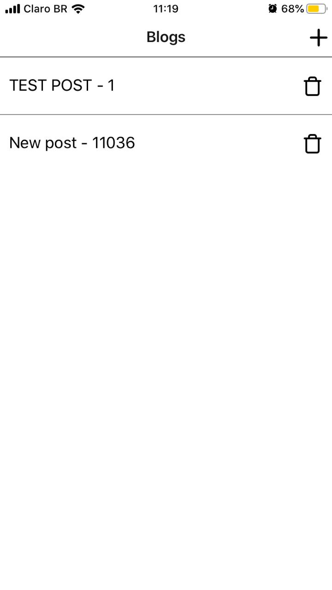

### :postbox: React-Native "Blog App"

  <a href="#rocket-tecnologias">Tecnologias</a>&nbsp;&nbsp;&nbsp;|&nbsp;&nbsp;&nbsp;
  <a href="#-projeto">Projeto</a>&nbsp;&nbsp;&nbsp;|&nbsp;&nbsp;&nbsp;
  <a href="#-layout">Layout</a>&nbsp;&nbsp;&nbsp;|&nbsp;&nbsp;&nbsp;

 

## :rocket: Tecnologias

Esse projeto foi desenvolvido com as seguintes tecnologias:

- [React Native](https://facebook.github.io/react-native/)
- [Expo](https://expo.io/)
- [Axios](https://github.com/axios/axios)

## 💻 Projeto

O Blog App é um projeto de aprendizado desenvolvido a partir do curso [The Complete React Native + Hooks Course [2019 Edition]](https://www.udemy.com/course/the-complete-react-native-and-redux-course) que visa a criação, listagem, remoção e atualização de posts utilizando array.

## 🔖 Layout

<h1 align="center">
     
    
    
    
    
</h1>

---

<!-- ### Create a New App
> `npx expo-cli init food`
`cd food`
`npm start`

#### Installing React-Navigation

> `npm install react-navigation`
`npx expo-cli install react-native-gesture-handler react-native-reanimated react-navigation-stack`

#### Importing in App.js

>`import { createAppContainer } from 'react-navigation';`
> `import { createStackNavigator } from 'react-navigation-stack'; `

#### Icons Listing

> https://expo.github.io/vector-icons/

#### Installing Axios

> `npm install axios`

My App

    Client ID

    oSKBPBtDQAGFVqvf0OZBzw
    API Key

    jeWhZ7L6xvOl4yfuwDcr7_X2iqwYhgqeYYInIcKO_jYjOHTAAEldDGgJJfao9pZ7IrOJ3G9cA1tUxcSNYKy-fpb72TABKyrFBWvFel_UKYGNyYHzXFUbunMFynenXXYx -->

<!-- Comandos a serem rodados - 3 janelas 
- npm start (blog)
- npm run db (json-server)
- npm run tunnel (json-server)
-->
